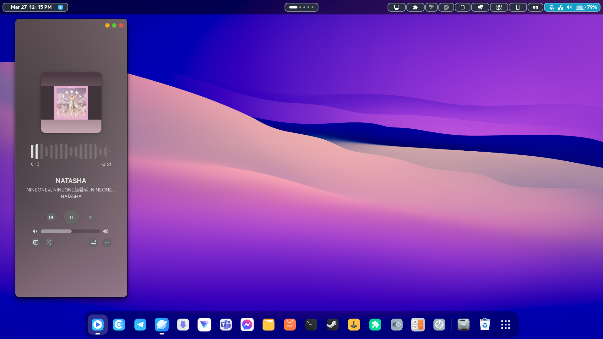
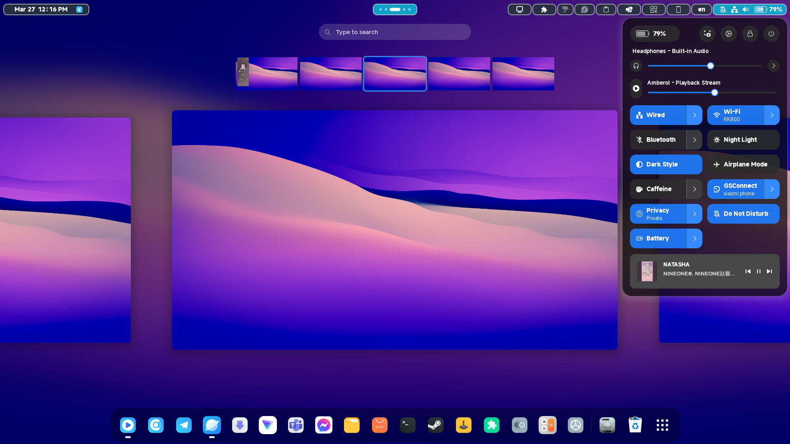
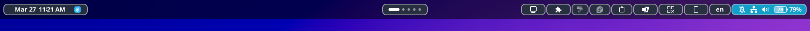

## HyperOS GNOME Theme

A GNOME theme inspired by Xiaomi's HyperOS UI/UX. It brings a vibrant, clean aesthetic to your Linux desktop with matching GTK, GNOME Shell, icons, sounds, and fonts.

### What's included
- **Theme**: `Hyperos-Dark` (GTK 2/3/4, GNOME Shell, Metacity, Cinnamon, Unity, Xfwm)
- **Icons**: `hyperos icons`
- **Sounds**: `hyperos sounds`
- **Fonts**: `font/MiSans_Arabic`, `font/MiSans_Latin`
- **Extensions bundle**: curated GNOME Shell extensions under `extenstions/`

### Note about OpenBar style
The `openbar@neuromorph` extension already includes a HyperOS style. Enable the extension and select the HyperOS style from its preferences.

---

## Screenshots

Below is a gallery of the theme in action.






---

## Installation

### 1) Theme (GTK + GNOME Shell)
Copy the `Hyperos-Dark` directory to your themes folder and select it:

```bash
# For single user
mkdir -p ~/.themes
cp -r Hyperos-Dark ~/.themes/

# For all users (requires sudo)
sudo mkdir -p /usr/share/themes
sudo cp -r Hyperos-Dark /usr/share/themes/
```

Use `gnome-tweaks` to select the theme (Shell, Legacy Applications, GTK, etc.).

### 2) Icons
```bash
mkdir -p ~/.icons
cp -r "hyperos icons" ~/.icons/

# Or system-wide
sudo mkdir -p /usr/share/icons
sudo cp -r "hyperos icons" /usr/share/icons/
```
Select the icon theme with `gnome-tweaks`.

### 3) Sounds
```bash
mkdir -p ~/.local/share/sounds
cp -r "hyperos sounds" ~/.local/share/sounds/
```
Select sound theme in your system sound settings if supported.

### 4) Fonts (MiSans)
```bash
mkdir -p ~/.local/share/fonts
cp -r font/MiSans_Arabic ~/.local/share/fonts/
cp -r font/MiSans_Latin ~/.local/share/fonts/
fc-cache -f
```
Set the font via `gnome-tweaks` → Fonts.

### 5) Extensions (optional)
Extensions are provided under `extenstions/` for convenience. Install them by copying each extension folder to your user extensions directory:

```bash
mkdir -p ~/.local/share/gnome-shell/extensions
cp -r extenstions/* ~/.local/share/gnome-shell/extensions/
```

Then restart GNOME Shell (on X11: press `Alt`+`F2`, type `r`, Enter) and enable extensions via `gnome-extensions-app` or `gnome-tweaks`.

Notes:
- `openbar@neuromorph`: includes HyperOS style (select in preferences)
- `dash-to-dock@micxgx.gmail.com`: dock customization
- `custom-osd@neuromorph`: styled OSD
- `user-theme@gnome-shell-extensions.gcampax.github.com`: load shell themes

---

## Requirements
- GNOME Shell (recent versions supported by provided themes)
- `gnome-tweaks` for switching themes, icons, and fonts
- Optional: `gnome-extensions-app` for extension management

---

## Troubleshooting
- If the Shell theme does not change, ensure the `User Themes` extension is enabled.
- After installing icons or themes system-wide, try `sudo gtk-update-icon-cache -f /usr/share/icons/<theme>` and relog.
- If fonts do not appear, rebuild caches with `fc-cache -f` and relog.
- On Wayland, GNOME Shell cannot be reloaded with `Alt`+`F2`. Log out/in instead.

---

## Credits
- Inspired by Xiaomi HyperOS UI/UX
- Based on and adapted from community themes on GnomeLook

## License
See licenses included inside each component directory (themes, icons, extensions). Unless stated otherwise, assets respect their original authors' licenses.

