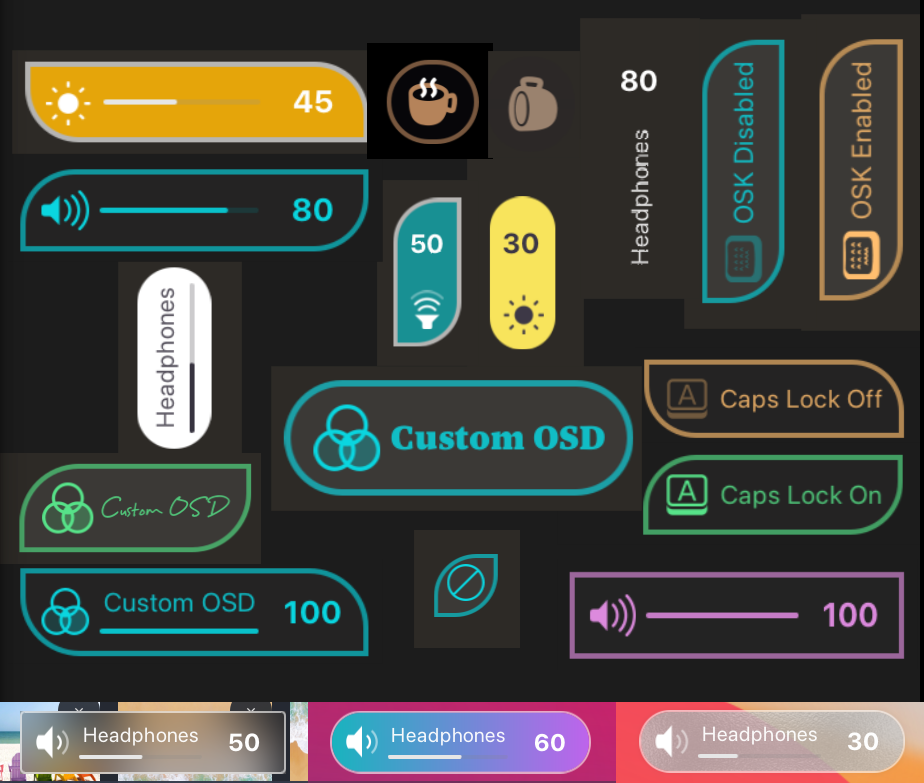
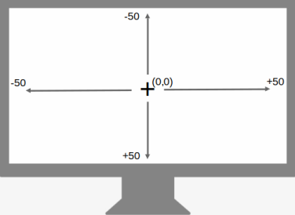
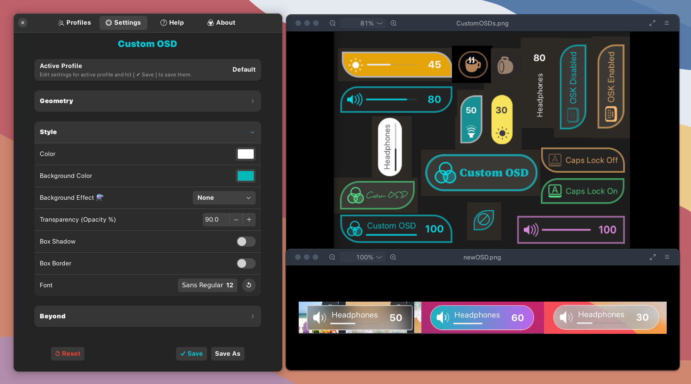
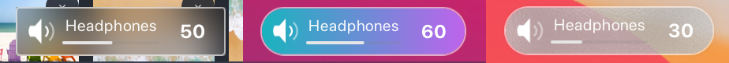

# Custom OSD (GNOME 4X Extension)  


A GNOME Shell extension allowing the user to customize the On Screen Display (OSD) pop ups on Gnome. You can set the **Geometry** (position, orientation, size, shape), **Style** (font, colors, shadow, transparency, background effects etc.) and **Beyond**: Set the delay of the OSD pop-ups and optionally display % value for OSDs with levels like Volume/Brightness etc. You can choose to display the OSD on Primary/ External or both the monitors and select what components to show. In summary, fully transform the OSD pop-ups to match your theme and liking!  
The new update allows to create and save multiple Settings profiles and choose one to apply. The profiles can be imported / exported to files. Profiles Presets (exported to file), [available here](https://github.com/neuromorph/custom-osd/tree/main/presets), can help as starter pack. Also, if you would like to share your settings profiles, do raise a PR or issue.

<p align="center">

</p>

## Installation

### Recommended

[](https://extensions.gnome.org/extension/6142/custom-osd/)

It's recommended to install the extension from
[extensions website](https://extensions.gnome.org/extension/6142/custom-osd/), or from
the _Extension Manager_ app.


### How to manually install the extension (if needed)?

```
git clone https://github.com/neuromorph/custom-osd.git \
	~/.local/share/gnome-shell/extensions/custom-osd@neuromorph
```
OR download the release zip file (may not be latest) and unzip at location: ~/.local/share/gnome-shell/extensions/

You may need to restart the gnome shell environnment (for manual install):

- logout and login again (Do this if using Wayland) _or_
- `alt+f2` then type `r` and `enter` 

## Settings
Use the Profiles panel in settings to create and manage settings profiles.  

Use the settings panel of the extension for most common customizations:  

* Position on Screen 
* Vertical/Horizontal Orientation
* Size 
* Hide-Delay time
* Color and Background
* Background effects
* Box Shadow On/Off
* Box Border On/Off
* Transparency
* Shape Shift: Pill/Rectangle/Other (interpolation)
* Numeric % for levels
* Monitor to show OSD on
* Set Font of OSD text
* Clock OSD to show current date/time
* Select what to show: Icon, Text, Level Bar, Numeric %

## Notes and Tips

**OSD What?**  
OSDs are On-Screen-Display pop ups that show up for volume, brightness etc. This extension allows you to  customize these pop ups, whether built-in or those created by extensions like Caffeine, Lock Keys etc. 

  
- In Profiles tab, create new profiles with default settings.
- Select a profile as Active and edit its settings in Settings tab.
- Type/edit the values and hit enter key to update OR
- Simply click the - + buttons or PgUp / PgDn keyboard keys.
- Press \[Save\] or \[Save As\] button to save the setting.
- Hover over the values/buttons for more info (tooltips).
- Position is (0,0) at screen-center. Range is -50 to +50 as shown above.
- Transparency setting applies to background transparency.
- Custom-color panel of Color button has foreground transparency slider
- Box Shadow is ON by default in Gnome. It is a shade of gray by default and will be visible if the OSD is relatively opaque and it appears on some lighter background. If your prefer more transparent and/or flat OSD then turn the shadow off.
- Icon is the only mandatory element for any OSD and thus, some of the OSDs may not have one or more of the other components (like label, level, numeric value). This is decided by the app that sends the OSD request (eg. Volume/Brightness app or Lock Keys). Out of the available components, this extension allows to choose what to show and hide.
- Vertical orientation may sometimes show a glitch in text rendering, please change the size of OSD by a bit to fix this.
- Font settting also provides an option to change font size (without changing other OSD components). Note that, a large font size will also push the OSD size. Also, if you icrease/decrease size of OSD through settings, it will try to proportionally increase/decrease the font size as well.
- Background effects are experimental. You can combine them with shadow, border or transparency etc. However, shadow can be less effective around rectangular shape with background effects. Other settings of Shape will work fine. Dynamic Blur will be rectangular. Gnome Shell Blur does not support rounded corners :(
- Further styling effects are possible by editing the extension's stylesheet (instructions below).


## Optional Advanced Styling
For optional styling of advanced css options or things like custom box-shadow effect that is not in settings, you will need to edit "spreadsheet.css" file at -  
~/.local/share/gnome-shell/extensions/custom-osd@neuromorph/  
 After editing the file, you need to disable and enable the extension for the changes to take effect. Alternately, you can lock the screen and unlock again.  
 This allows for some esoteric tinkering for the ones so inclined. 

Example code:
```
.osd-style {
    font-family: Cursive; /* To use this, reset font in settings to default */
    box-shadow: 1px 1px 5px grey;  /* To use this, turn On box shadow in settings */
}
```

## Translations

[Gettext](https://www.gnu.org/software/gettext/) is a localization framework for writing multi-lingual applications that is also used by GNOME Shell extensions.  
This extension provides a [template file](po/custom-osd@neuromorph.pot) (.pot) that contains a list of all the translatable strings in this project. Translators can use this template to create a (.po) translation file (e.g. fr.po for French).

Translators can use tools like [Gtranslator](https://flathub.org/apps/details/org.gnome.Gtranslator) or [POEdit](https://flathub.org/apps/details/net.poedit.Poedit) or any other online tools to work with the .pot files and create a .po for your language. 

The translation .po files go in the 'po' directory.  
The compiled translation i.e. the .mo file can be created from the .po file with this command (e.g. fr.po to fr.mo)  
` $ msgfmt -o fr.mo /path/to/fr.po ` - Replace /path/to with file path.  
The .mo file goes inside the 'locale' directory under corresponding subpath and filename as 'custom-osd.mo'. For 'fr', ` locale/fr/LC_MESSAGES/custom-osd.mo ` .  
Please submit a pull request when ready. Thanks in advance!  

Note: There is a lot of text here (check the .pot file) esp. due to the Help tab, field descriptions and tooltips. So, partial translations are welcome as well. Ideally, a bare minimum would be to translate the functional UI part i.e. 'Profiles' and 'Settings' tabs UI even without the tooltips. This should already allow people to use the extension in their language. You may later want to add the translations for tooltips and other tabs or someone else can pitch in. 

| Language | Translated By | Status |
| ------------- | ------------- | ------------- |
| Indonesian (ID)  | Ilham Adi Setiawan (@[IlhamSetiawan](https://github.com/IlhamSetiawan))  |  Completed  |
| Spanish (ES) | summus imperator(@[Nosis](https://github.com/Nosis))  |  Completed  |
  
  
## What's New (recent first)
- New Profiles tab to create/manage settings profiles. Multiple profiles can be saved, imported, exported etc. Then on, just select a profile as Active profile to apply to OSDs. Also, new background effect - Dynamic Blur.
- New background effects! Also, show/hide components based on OSD type
- Preferences moved to Adwaita ui, code updated to prepare for translations
- New clock OSD to show current date/time and option to set OSD font in settings
- Some refactor, button to reset settings to default, foreground trasparency option integrated in color, shape shift, fix defaults.
- Select any combinations of OSD components to display. New test-OSD for instant feedback when changing settings. Refactor to preset OSDs with customization and minimize runtime adaptation.
- Improved positioning logic to snap fit edges
- Improved efficiency and compatibility
- Added support for Numeric level %, Monitors to display OSD and Box Border
- Added support for Color+BG Color, Shadow and Orientation
- Settings updated to include Color and Transparency options
- Cleanup and upload initial version to Gnome extensions store
- Metadata updated for Gnome 44
- Ported for GNOME 42 + some fixes


## Screenshots





## Acknowledgements

- This extension started from [Better OSD](https://extensions.gnome.org/extension/1345/better-osd/) and its Gnome 40 [update](https://extensions.gnome.org/extension/4231/better-osd-gnome-40/). Better OSD became obsolete and forked versions also do not support new OSD modifications in GNOME shell after GNOME 41+. Custom-OSD began with porting the old extension to new GNOME mods so I could continue to use it locally. Eventually, I decided to put it out in case it is helpful to others as well. It soon found many users and many new feature requests as well, so I ended up rewriting the entire code for refinements/bug-fix/refactor and many new features. Nevertheless, Better OSD served as the inspiration and starter code and was an OSD lifesaver back in the days, many thanks to them!
- Also thanks to users who appreciated the project, raised issues and requested new features here and on Gnome Extensions website. In particualr, [RedBearAK](https://github.com/RedBearAK) thoroughly reviewed the extension revisions and suggested [many ideas](https://github.com/neuromorph/custom-osd/issues/3) (most have been incorporated). Much appreciated!

